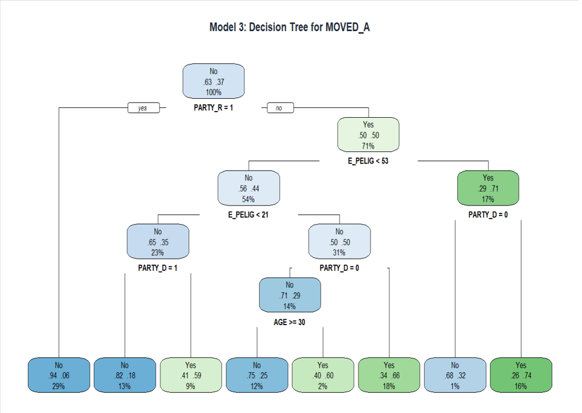
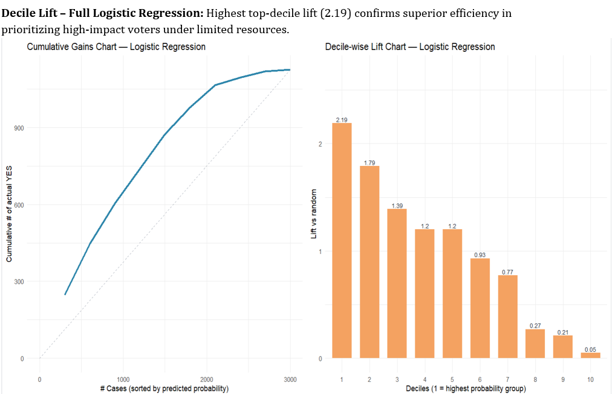

<div align="center">

# Campaign Decision Intelligence

### End-to-End Machine Learning for Voter Targeting & Campaign Optimization

*Can machine learning identify the voters who matter most before a campaign spends a single dollar?*

<br>


### 🗳️ Campaign Analytics • 👥 10,000 Voters • 📈 Explainable Machine Learning

</div>

---

## Executive Summary

Every campaign faces the same challenge.

Thousands of voters.

Limited budget.

Limited time.

Yet campaigns often invest resources equally across voters, even though only a fraction are realistically persuadable.

This project demonstrates how machine learning can transform raw voter data into **actionable campaign intelligence** by predicting persuasion probability, identifying high-impact voter segments, and supporting smarter outreach decisions.

Rather than replacing human decision-making, the models provide explainable insights that help campaign teams focus their efforts where they can create the greatest impact.

---

# From Data to Decisions

```text
Registered Voters
        │
        ▼
Data Preparation
        │
        ▼
Feature Engineering
        │
        ▼
Machine Learning
        │
        ▼
Persuasion Prediction
        │
        ▼
Campaign Decision Support
```

---

# Can Machine Learning Improve Campaign Targeting?



The Decision Tree transforms complex voter characteristics into clear and interpretable decision rules, revealing how demographics, party affiliation, eligibility scores, and historical behavior influence voter persuasion.

---

# Does Predictive Targeting Actually Work?



Instead of contacting every voter, predictive ranking allows campaigns to prioritize the individuals most likely to be persuaded—making outreach more efficient while maximizing campaign resources.

---

# Why This Project Stands Out

✅ Predicts voter persuasion before campaign outreach

✅ Compares multiple machine learning models

✅ Provides interpretable decision rules—not black-box predictions

✅ Demonstrates measurable business value using Gains and Lift analysis

✅ Bridges machine learning with real-world campaign decision-making

---

# Explore the Project

<table>
<tr>
<td align="center" width="25%">

## 📄 Documentation

Complete methodology, business understanding, model development, evaluation, and recommendations.

**➡️ [Open Documentation](documentation/)**

</td>

<td align="center" width="25%">

## 💻 Code

End-to-end R implementation including preprocessing, feature engineering, predictive modeling, and evaluation.

**➡️ [Explore Code](code/)**

</td>

</tr>

<tr>

<td align="center">

## 📊 Visualizations

Business insights, decision trees, gains charts, lift charts, exploratory analysis, and model comparisons.

**➡️ [View Plots](plots/)**

</td>

<td align="center">

## 📁 Dataset

Original voter dataset used throughout the complete machine learning pipeline.

**➡️ [Browse Dataset](data/)**

</td>

</tr>

</table>

---

<div align="center">

### Great campaigns don't reach every voter.

## They reach the **right** voter.

</div>
